# Tag-A-Log - Client

## LIVE APP

- https://tag-a-log.now.sh/

## Summary

-An information, bookmarks and log manager that allows users to store urls, code snippets or articles notes with appropriate description and "tag" them for categorization and fast searching for easier log management.

## Tech Stack

- Reactjs
- React Router
- React Context
- JavaScript ES6
- JSX/HTML 5
- CSS3
- Enzyme/Jest
- Zeit

## Screenshots

### Landing Page

- Desktop
  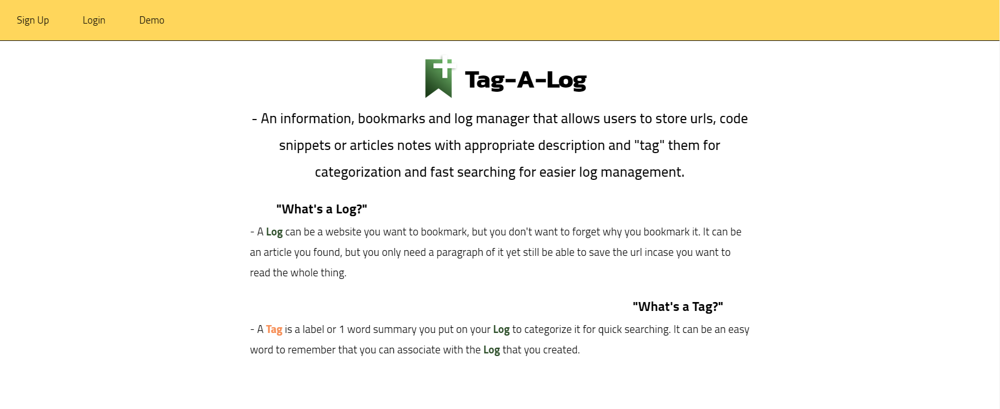

- Mobile
  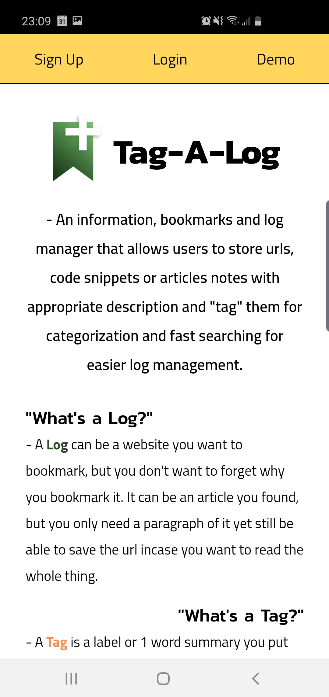

### Dashboard Page

- Desktop
  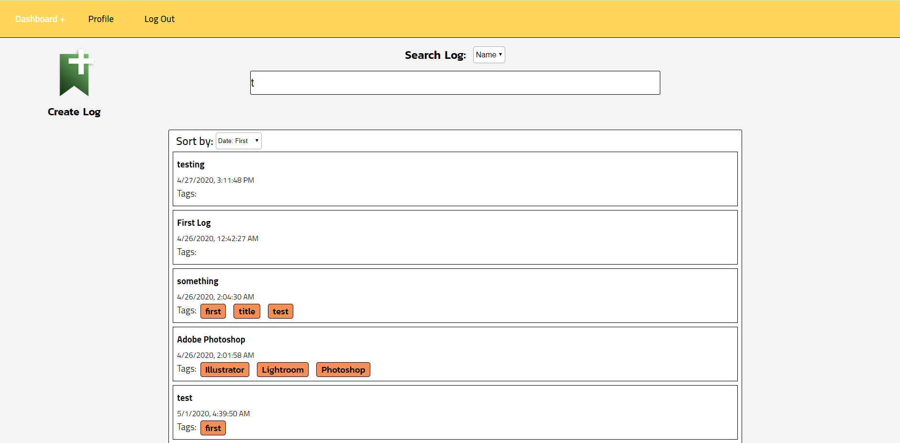

- Mobile
  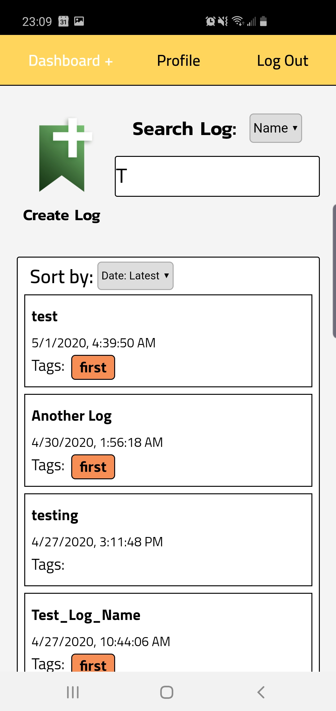

### Profile Page

- Desktop
  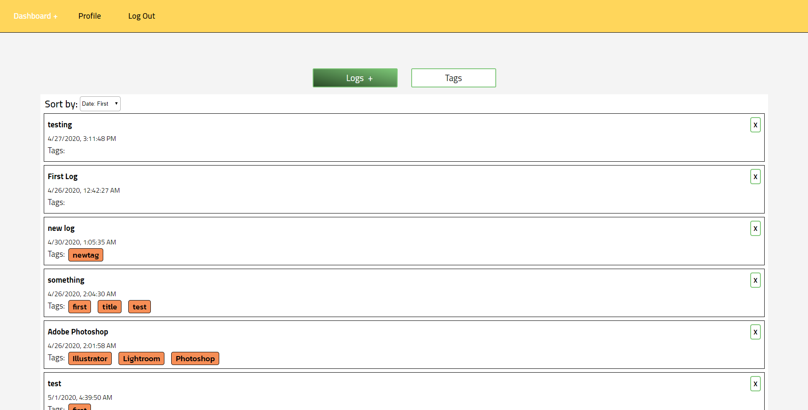

- Mobile
  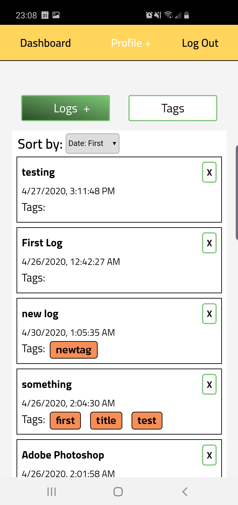

- Mobile
  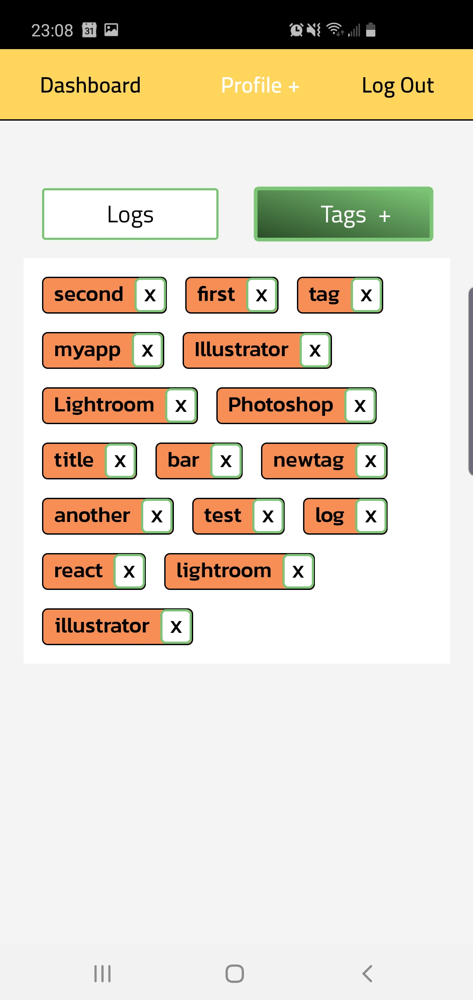

### Log Page

- Desktop
  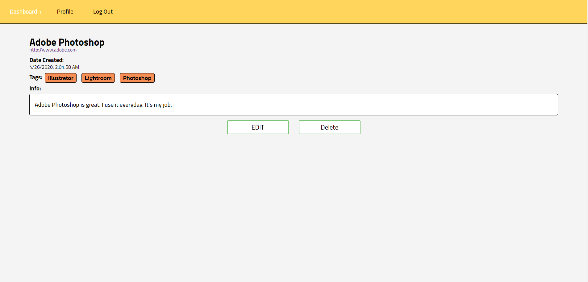

- Mobile
  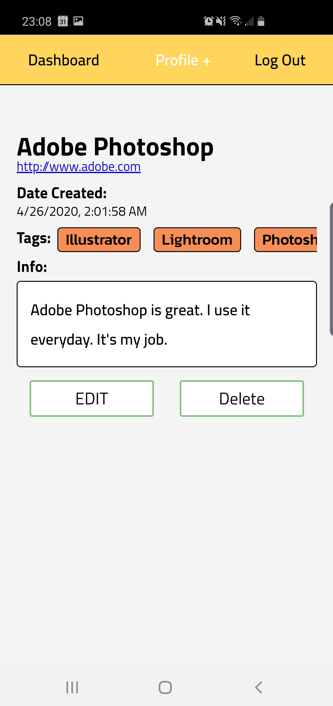

### Edit/Create Page

- Desktop
  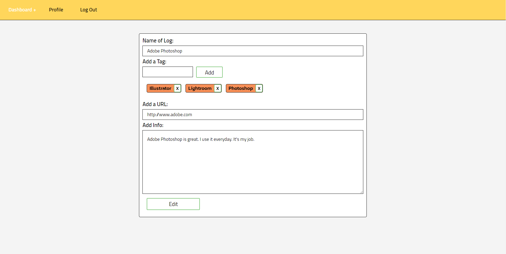

- Mobile
  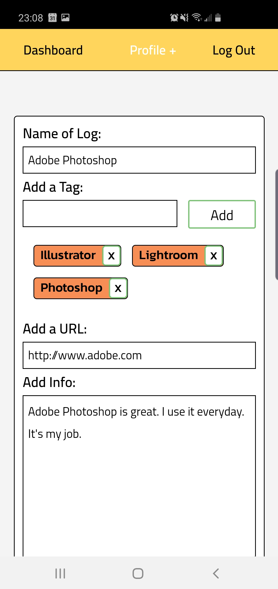

## In Development

- Allow user to add Images to their logs
- Allow users to upload Files to their logs
- Loading animation
- Allow users to change background color of tags
